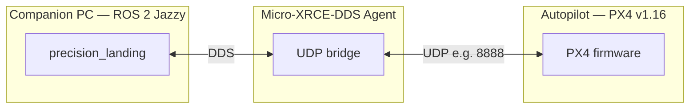
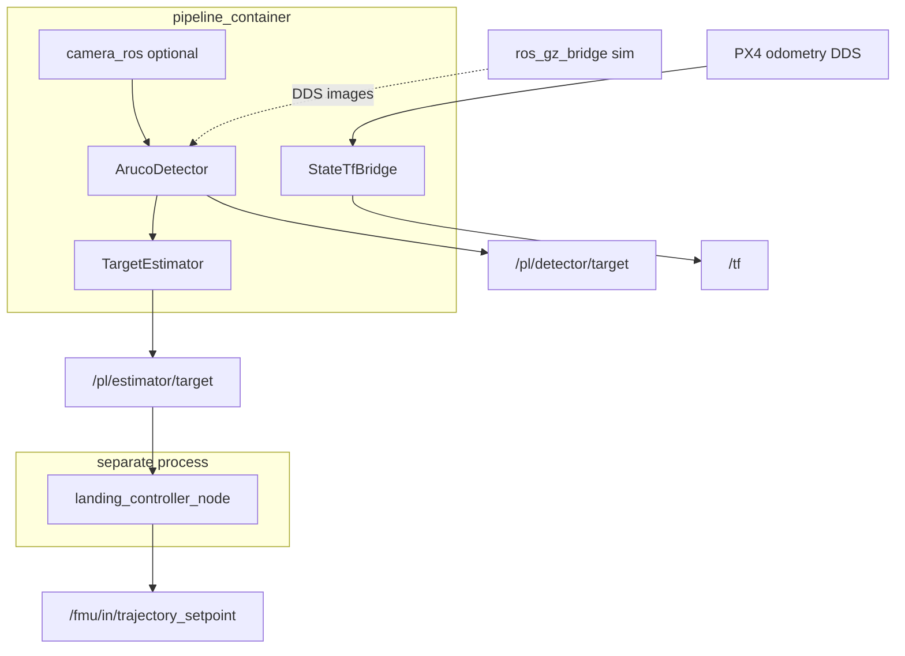

# Precision Landing — ROS 2 / PX4

Vision-based precision landing system for PX4 drones using ArUco markers.
Runs on **ROS 2 Jazzy** with **PX4 Autopilot v1.16**.

## Architecture

### System context

The stack targets a **companion computer** (Ubuntu, ROS 2) communicating with a **PX4 flight controller** over **DDS**, bridged by the **Micro-XRCE-DDS Agent** (UDP). This repository contains perception, estimation, TF, and trajectory logic—it does **not** ship PX4 firmware.



**Hardware:** camera → ROS → DDS → FCU. **SITL:** Gazebo + PX4 SITL + `ros_gz_bridge` provide synthetic images; the same ROS nodes run with `use_camera:=false`.

### Colcon workspace layout

| Layer | ROS package / tree | Role |
| ----- | ------------------- | ---- |
| Messages | `precision_landing_msgs` | `TargetState`, `LandingState` |
| Vendored | `px4_msgs`, `px4_ros2_cpp` (from `px4_ros2_interface_lib`) | PX4 message set and C++ interface (custom modes, setpoints) |
| Camera | `camera_ros` (submodule) | libcamera → `sensor_msgs/Image` on real hardware |
| Application | `precision_landing` | Nodes, `system.launch.py`; **`config/params.yaml`** (flight default); **`config/sim/`** — SITL only (`sim_params.yaml`, `gz_bridge.yaml`, `rosbag_qos_overrides.yaml`) |
| Not built by default | `vision_opencv` submodule | Reference only; use `ros-jazzy-cv-bridge` |

The Git checkout directory is often named `precision-land`; the **ROS package** you launch and install is **`precision_landing`** under `src/precision_landing/`.

Build order is automatic with `colcon --packages-up-to precision_landing` ([Build Order](#build-order-automatic)).

### Runtime processes

1. **`pipeline_container`** (`component_container_mt`): optional **`camera_ros`**, then **ArucoDetector** → **TargetEstimator** → **StateTfBridge**. With a real camera, image data stays **intra-process** from `camera_ros` through the EKF. In simulation, `camera_ros` is omitted; images enter via DDS from `ros_gz_bridge`.

2. **`landing_controller_node`** (separate process): PX4 custom mode, landing FSM, trajectory setpoints. Kept **outside** the container so the controller can **respawn** and stay alive if the vision pipeline crashes.



### Nodes ([`system.launch.py`](src/precision_landing/launch/system.launch.py))

| Component | ROS name | Type | Description |
| --------- | -------- | ---- | ----------- |
| `camera_ros` | `camera_driver` | Composable | Camera → `/pl/camera/image_raw` (skipped when `use_camera:=false`) |
| `ArucoDetector` | `aruco_detector` | Composable | Marker pose → `/pl/detector/target` (`TargetState`) |
| `TargetEstimator` | `target_estimator` | Composable | CV EKF → `/pl/estimator/target` |
| `StateTfBridge` | `state_tf_bridge` | Composable | Vehicle odometry → TF for vision |
| `LandingController` | `landing_controller` | Standalone | Mode + FSM + setpoints; **respawn** |

### Simulation vs onboard

| | Onboard | SITL (`make sim`) |
| --- | --- | --- |
| Images | `camera_ros` + hardware | `ros_gz_bridge` + Gazebo |
| PX4 | Real FCU | PX4 SITL + same DDS topics |
| Extra deps | `setup.sh` (core) | `setup.sh sim` + `gz` + PX4 tree at `PX4_DIR` |

Wall clock only: **`use_sim_time` is not set** in the launch file.

---

## Installation

### 1. Requirements

- **Ubuntu 24.04** (Noble)
- **ROS 2 Jazzy** — [official installation](https://docs.ros.org/en/jazzy/Installation/Ubuntu-Install-Debs.html) (`ros-jazzy-ros-base` or `ros-jazzy-desktop`; `scripts/setup.sh` adds the remaining project dependencies)

### 2. Clone and submodules

```bash
git clone --recurse-submodules https://github.com/<your-org>/precision-land.git
cd precision-land
```

If you cloned without submodules:

```bash
git submodule update --init --recursive
```

| Path | Repository | Branch |
| ---- | ---------- | ------ |
| `src/external/px4_msgs` | [PX4/px4_msgs](https://github.com/PX4/px4_msgs) | release/1.16 |
| `src/external/px4_ros2_interface_lib` | [Auterion/px4-ros2-interface-lib](https://github.com/Auterion/px4-ros2-interface-lib) | release/1.16 |
| `src/external/camera_ros` | [christianrauch/camera_ros](https://github.com/christianrauch/camera_ros) | **tag v0.5.2** (pinned SHA) |
| `src/external/vision_opencv` | [ros-perception/vision_opencv](https://github.com/ros-perception/vision_opencv) | rolling |

`vision_opencv` is not built by default (`cv_bridge` comes from `ros-jazzy-cv-bridge`).

**`camera_ros` version:** the workspace pins **v0.5.2** so it compiles against **Ubuntu 24.04 / Noble `libcamera` 0.2.x** from apt. **v0.6.0** switches to `ControlList::merge(..., MergePolicy::...)`, which is not in that distro libcamera; use v0.6.0 or `main` only if you install a newer libcamera (e.g. custom build / non-default packages) and point `pkg-config` at it.

### 3. System packages (`scripts/setup.sh`)

Run from the workspace root. Pick a **profile**:

| Profile | Use case | Extra packages (beyond shared baseline) |
| ------- | -------- | ----------------------------------------- |
| `core` (default), `hardware`, `flight` | Onboard / production | **None** — no `ros_gz_bridge`, no `xterm` |
| `sim` | `make sim`, SITL | `ros-jazzy-ros-gz-bridge`, `xterm` |
| `sim-report` | `make report` | `sim` + `rosbag2` + MCAP storage |

**Baseline (every profile):** `ros-jazzy-ros-base`, `ros2cli`, `rclpy`, `cv-bridge`, `image-transport`, `camera-info-manager`, `tf2-ros`, `tf2-geometry-msgs`, `eigen3-cmake-module`, `python3-colcon-common-extensions`, `libopencv-dev`, `libeigen3-dev`, `python3-yaml`.

```bash
# Onboard / flight (minimal)
bash scripts/setup.sh

# Workstation with SITL
bash scripts/setup.sh sim
# If `gz` is missing: sudo apt install gz-harmonic

# Bag analysis / reports
bash scripts/setup.sh sim-report
```

Manual fallback (if you do not use the script): `libopencv-dev`, `libeigen3-dev`, `ros-jazzy-eigen3-cmake-module`, plus the ROS packages listed in `scripts/setup.sh`.

### 4. Micro-XRCE-DDS Agent (PX4 ↔ ROS 2)

Required for **both** real flights and SITL so PX4 and ROS 2 share DDS via UDP.

```bash
sudo snap install micro-xrce-dds-agent --edge
```

When testing, start the agent (port must match your stack, default **8888**):

```bash
micro-xrce-dds-agent udp4 -p 8888 &
```

Snap installs may expose the binary as `micro-xrce-dds-agent`; some builds use `MicroXRCEAgent`. See also [eProsima Micro XRCE-DDS](https://micro-xrce-dds.docs.eprosima.com).

### 5. Build and source

```bash
source /opt/ros/jazzy/setup.bash
make
```

`make` runs `make build-safe` (sequential colcon, `--packages-up-to precision_landing`). For faster builds: `make PARALLEL_WORKERS=4 MAKE_JOBS=$(nproc)`.

Every new shell:

```bash
source /opt/ros/jazzy/setup.bash
source install/setup.bash
```

(`install/local_setup.bash` is also valid.)

### 6a. Run on real hardware

1. Network/firewall: companion PC can reach the FCU; UDP open for uXRCE/DDS as configured.
2. Start the agent (if not already running): `micro-xrce-dds-agent udp4 -p 8888 &`.
3. Camera: USB/CSI working; tune [`params.yaml`](src/precision_landing/config/params.yaml) (`camera_driver`, calibration URL if used).
4. Launch:

```bash
ros2 launch precision_landing system.launch.py
```

Optional: `params_override:=/path/to/override.yaml`.

### 6b. Optional: SITL simulation

Use a machine where you ran **`setup.sh sim`** (and usually a separate **PX4-Autopilot** checkout). Same entry point as **`make sim`**.

1. **Gazebo Harmonic:** `gz sim` on `PATH` (e.g. `sudo apt install gz-harmonic`, or PX4’s dev environment).
2. **PX4:** clone PX4 for **v1.16**, build SITL, e.g. `make px4_sitl_default` ([PX4 build guide](https://docs.px4.io/main/en/dev_setup/building_px4.html)).
3. **Point this repo at PX4:**

```bash
export PX4_DIR=/path/to/PX4-Autopilot   # default in scripts/sim_launch.sh: ~/Dev/Autopilot
```

If `make sim` fails with missing `px4`, `aruco.sdf`, or `x500_mono_cam_down`, fix `PX4_DIR` or finish the PX4 build—`scripts/sim_launch.sh` validates paths.

4. Run: `make sim` or `bash scripts/sim_launch.sh`; stop: `make sim-stop` / `bash scripts/sim_stop.sh`.

A **vehicle-only** computer does **not** need the PX4 source tree or Gazebo.

---

## Build

Quick path: [Installation §5](#5-build-and-source). Below: Makefile targets and raw `colcon` options.

### Quick Build (recommended)

```bash
source /opt/ros/jazzy/setup.bash
make
```

This runs `make build-safe` — conservative parallelism (1 worker, 1 make job),
builds all packages with automatic dependency resolution.

### Build Targets

| Target                       | Description                                                                                                          |
| ---------------------------- | -------------------------------------------------------------------------------------------------------------------- |
| `make build-safe`            | Full build with resource limits (default)                                                                            |
| `make build-core-safe`       | Same package set as `build-safe` today (`precision_landing_msgs`, `precision_landing` + deps via `--packages-up-to`) |
| `make build-test`            | Debug build with testing enabled                                                                                     |
| `make test`                  | Run unit tests (requires `build-test` first)                                                                         |
| `make sim` / `make sim-stop` | Start / stop SITL + stack (see `scripts/sim_launch.sh`)                                                              |
| `make report`                | HTML report from newest sim bag or `BAG=…`                                                                           |
| `make report-open`           | Open latest `report.html` under `log/`                                                                               |
| `make tidy`                  | Trim old sim sessions and temp files                                                                                 |
| `make clean`                 | Remove `build/`, `install/`, `log/`                                                                                  |

### Override Resource Limits

```bash
# Faster build on powerful machine
make build-safe PARALLEL_WORKERS=4 MAKE_JOBS=$(nproc)

# Minimal resources (Raspberry Pi / low-end laptop)
make build-safe PARALLEL_WORKERS=1 MAKE_JOBS=1
```

### Colcon one-liners (no wrapper script)

```bash
source /opt/ros/jazzy/setup.bash
colcon build --base-paths src --symlink-install --packages-up-to precision_landing \
  --parallel-workers 4 --cmake-args -DCMAKE_BUILD_TYPE=Release
```

### Build Order (automatic)

The build system uses `--packages-up-to` to resolve dependencies:

```
px4_msgs  ──────────────┐
                        ├──▸ px4_ros2_cpp ──┐
precision_landing_msgs ─┘                   ├──▸ precision_landing
                        ────────────────────┘
```

## Run

### Source the Workspace

```bash
source /opt/ros/jazzy/setup.bash
source install/local_setup.bash
```

### Real Hardware

```bash
# Start Micro-XRCE-DDS agent (connect PX4 ↔ ROS 2)
micro-xrce-dds-agent udp4 -p 8888 &

# Launch with USB camera (canonical launch file lives in this package)
ros2 launch precision_landing system.launch.py
```

### Simulation (Gazebo Harmonic + PX4 SITL)

See [Installation §6b](#6b-optional-sitl-simulation). Set `PX4_DIR` if your PX4 tree is not at `~/Dev/Autopilot`.

```bash
# One-command sim launch (PX4 SITL + Gazebo + gz_bridge + nodes)
make sim

# Or manually:
bash scripts/sim_launch.sh

# Stop simulation
bash scripts/sim_stop.sh
```

Each sim session writes a **rosbag2** under `log/sim/session_<id>/rosbag/flight_data/` (topics listed in `scripts/sim_launch.sh`, aligned with `scripts/pl_report/config.py` `RECORD_TOPICS`), with **`--include-unpublished-topics`** so recording starts even before e.g. `/pl/controller/status` exists. PX4/pl topics that publish **best_effort** need matching subscription QoS: **`share/precision_landing/config/sim/rosbag_qos_overrides.yaml`** (or `src/precision_landing/config/sim/` before build) is passed to `ros2 bag record` from `scripts/sim_launch.sh` (same idea as recording on a real vehicle). `make sim-stop` sends SIGINT so the bag flushes cleanly (recorder is started under `scripts/exec_default_signals.py` so SIGINT is not ignored). **`make report`** without `BAG=` picks the **newest** `log/sim/session_*` that contains a bag only — it does **not** silently use an older session. Override **`DELAY_BAG_S`** (default `DELAY_STACK_S+5`) if needed; set **`SKIP_BAG=1`** to disable recording. Simulation **TF** is handled inside **`StateTfBridge`** (not a separate `sim_tf_publisher.py`). **`GZ_GUI`**: defaults in `scripts/sim_launch.sh` may start a Gazebo GUI process; set **`GZ_GUI=0`** for a fully headless sim (server + bridge only).

### Flight log report (HTML)

Reports analyze an **existing** rosbag only (no in-tool recording). After sourcing the workspace and ROS:

| Command                            | Effect                                                                                      |
| ---------------------------------- | ------------------------------------------------------------------------------------------- |
| `make report`                      | Newest bag under `log/sim/session_*/rosbag/…` → HTML + JSON under `log/report/<timestamp>/` |
| `make report BAG=/path/to/bag_dir` | Use that rosbag2 directory explicitly                                                       |
| `./scripts/report.sh`              | Same as `make report` (optional `--bag`, `--output`)                                        |

Direct Python (e.g. CI): `PYTHONPATH=scripts python3 -m pl_report.cli --bag /path/to/bag`. Implementation: **`scripts/pl_report/`** (see `cli.py`, `report_generator.py`).

Install bag-reading deps on a fresh machine: `bash scripts/setup.sh sim-report` (adds `ros-jazzy-rosbag2` and MCAP storage).

### Launch Arguments (`system.launch.py`)

| Argument          | Default | Description                                                           |
| ----------------- | ------- | --------------------------------------------------------------------- |
| `use_camera`      | `true`  | Set `false` in sim (`gz_bridge` provides images)                      |
| `params_override` | `""`    | Extra YAML merged after `config/params.yaml` (e.g. `config/sim/sim_params.yaml`) |

```bash
# Sim mode (no camera, sim params)
ros2 launch precision_landing system.launch.py \
  use_camera:=false \
  params_override:=$(ros2 pkg prefix precision_landing)/share/precision_landing/config/sim/sim_params.yaml
```

Tunable sim / SITL timing and GUI: see environment variables at the top of `scripts/sim_launch.sh` (`DELAY_STACK_S`, `DELAY_BAG_S`, `SKIP_BAG`, `GZ_GUI`, etc.).

## Configuration

### Parameters

- [config/params.yaml](src/precision_landing/config/params.yaml) — Default parameters
- [config/sim/sim_params.yaml](src/precision_landing/config/sim/sim_params.yaml) — SITL ROS parameter overrides (with [gz_bridge.yaml](src/precision_landing/config/sim/gz_bridge.yaml), [rosbag_qos_overrides.yaml](src/precision_landing/config/sim/rosbag_qos_overrides.yaml))

Key parameters:

| Parameter                            | Section      | Description                   |
| ------------------------------------ | ------------ | ----------------------------- |
| `marker_id` / `marker_size_m`        | `aruco`      | ArUco target config           |
| `kp_xy` / `max_vel_xy`               | `controller` | XY approach gains             |
| `v_max_descent` / `land_z`           | `controller` | Descent profile               |
| `timeout_short_s` / `timeout_long_s` | `controller` | Signal loss → hover / RTL     |
| `r_land`                             | `controller` | Max XY error to begin descent |

### EKF Tuning Guide

The `TargetEstimator` uses a 6-state constant-velocity Kalman filter (cv::KalmanFilter)
with altitude-adaptive process noise and a chi-squared innovation gate.

#### Key EKF Parameters

| Parameter    | Base   | Sim   | Effect                                              |
| ------------ | ------ | ----- | --------------------------------------------------- |
| `q_acc_x/y`  | 0.8    | 0.15  | Process noise — lower = smoother, higher = reactive |
| `q_acc_z`    | 0.3    | 0.08  | Z process noise                                     |
| `r_pos_x/y`  | 0.0005 | 0.005 | Measurement noise — higher = trust KF more          |
| `r_pos_z`    | 0.0008 | 0.004 | Z measurement noise                                 |
| `gate_sigma` | 4.0    | 4.0   | Innovation gate threshold (σ). Rejects outliers     |
| `decay_rate` | 2.0    | 3.0   | Confidence decay rate when marker lost [s⁻¹]        |

**Tuning rules:**

- Q/R ratio determines filter bandwidth. High Q/R → fast but noisy. Low Q/R → smooth but laggy.
- For a stationary target, `q_acc` should be small (target doesn't accelerate).
- `r_pos` should match actual detector noise (~5 mm for ArUco in sim, ~0.5 mm with perfect lens).
- `gate_sigma = 4.0` rejects measurements >4σ from prediction (chi-squared, 3 DOF).

#### Controller Tuning

| Parameter       | Base | Sim  | Effect                                           |
| --------------- | ---- | ---- | ------------------------------------------------ |
| `kp_xy`         | 0.4  | 0.6  | XY proportional gain — higher = more aggressive  |
| `kv_xy`         | 0.0  | 0.18 | Velocity feedforward — requires smooth KF output |
| `r_land`        | 0.5  | 0.35 | XY radius to allow descent [m]                   |
| `v_max_descent` | 1.5  | 1.5  | Max vertical speed during descent [m/s]          |
| `slew_rate`     | 1.5  | 2.0  | Velocity command ramp limit [m/s²]               |

**Tuning rules:**

- Enable `kv_xy` only after KF velocity is smooth (acc < 1 m/s²).
- Larger `r_land` reduces ALIGNING↔DESCENDING oscillation but allows more XY drift.
- Slower `v_max_descent` gives more time to correct XY during descent.

### Simulation Tuning Results

Benchmark on Gazebo Harmonic + PX4 SITL, 0.5 m ArUco marker at origin, spawn at (0,0,5).

| Metric            | Baseline  | Phase 1  | Phase 2  | Phase 3 (best) |
| ----------------- | --------- | -------- | -------- | -------------- |
| Landing final XY  | 4.2 cm    | 3.9 cm   | 1.9 cm   | **0.5 cm**     |
| Innovation XY     | 0.084 m   | 0.079 m  | 0.033 m  | 0.070 m        |
| Innovation Z bias | −0.191 m  | −0.294 m | −0.143 m | **−0.130 m**   |
| KF acceleration   | 13.7 m/s² | 0.374    | 0.028    | 0.041          |
| Approach p95      | 0.192 m   | 0.298 m  | 0.418 m  | **0.180 m**    |
| Cam→Ctrl latency  | 47 ms     | 60 ms    | 61 ms    | 61 ms          |

**Phase summary:**

1. **Baseline** — Default params. KF too noisy (Q/R ratio too high).
2. **Phase 1** — EKF: lower Q, raise R. KF 37× smoother.
3. **Phase 2** — Add innovation gate + Z tuning. Landing 1.9 cm.
4. **Phase 3** — Controller: raise kp_xy/kv_xy, slower descent. **Landing 0.5 cm.**

### Custom Messages

| Message        | Topic                                         | Description                 |
| -------------- | --------------------------------------------- | --------------------------- |
| `TargetState`  | `/pl/detector/target`, `/pl/estimator/target` | Target detection & estimate |
| `LandingState` | `/pl/controller/status`                       | FSM state for monitoring    |

## Systemd Service (Production)

`WS_DIR` must be the **machine-local** path to this workspace (the directory that contains `install/`).

```bash
export USER_NAME=$(whoami)
export ROS_DISTRO=jazzy
export WS_DIR=$(pwd)
export XRCE_PORT=8888

envsubst < services/precision_landing.service.in \
    > /tmp/precision_landing.service

sudo cp /tmp/precision_landing.service /etc/systemd/system/
sudo systemctl daemon-reload
sudo systemctl enable --now precision_landing
```

## Deploying on another PC or onboard computer

Use **Ubuntu 24.04** and **ROS 2 Jazzy**. For flight hardware, minimal deps:

```bash
bash scripts/setup.sh
```

Use `scripts/setup.sh sim` or `sim-report` only on machines that run SITL or analyze bags. Clone with submodules, build (`make`), and each shell:

```bash
source /opt/ros/jazzy/setup.bash
source install/setup.bash
```

Copying only `install/` to another machine works only if paths and architecture match; **rebuilding on the target** after `setup.sh` is the reliable approach. Start the Micro-XRCE-DDS agent before the stack. Optional: systemd with `WS_DIR` pointing at the deployment directory ([Systemd](#systemd-service-production)).

## Project Structure

```
precision-land/
├── GNUmakefile                 # Build, sim, report, tidy targets
├── scripts/
│   ├── setup.sh                # apt profiles: core (default), sim, sim-report; aliases hardware, flight
│   ├── report.sh               # Report entrypoint (`make report`)
│   ├── sim_launch.sh           # SITL simulation launcher
│   ├── sim_stop.sh             # Kill simulation processes
│   ├── exec_default_signals.py # SIGINT-safe wrapper for background ros2 bag record
│   ├── cleanup.sh              # Disk cleanup for old sessions (`make tidy`)
│   └── pl_report/              # Flight HTML/JSON report (CLI: `python3 -m pl_report.cli`)
├── services/
│   └── precision_landing.service.in  # systemd unit template
└── src/
    ├── external/               # Git submodules (do NOT modify)
    │   ├── px4_msgs/           # PX4 message definitions
    │   ├── px4_ros2_interface_lib/  # PX4 ↔ ROS 2 C++ interface
    │   ├── camera_ros/         # libcamera → ROS 2 (hardware camera)
    │   └── vision_opencv/      # Reference only (cv_bridge from apt)
    ├── precision_landing/      # Main package (nodes, launch, params + sim YAML)
    │   ├── include/            # C++ headers
    │   ├── src/                # Node implementations
    │   ├── config/             # params.yaml; sim/ = SITL only (sim_params, gz_bridge, rosbag QoS)
    │   └── launch/             # system.launch.py
    └── precision_landing_msgs/ # Custom message definitions
        └── msg/
            ├── TargetState.msg
            └── LandingState.msg
```

## Troubleshooting

### Build fails on `vision_opencv`

This is expected — the `vision_opencv` submodule contains ROS 1 build files.
The build system skips it automatically via `--packages-up-to`.
If you see this error with older build commands, use `make build-safe` instead.

### `px4_ros2_cpp` not found

Ensure submodules are initialized:

```bash
git submodule update --init --recursive
```

### Missing `eigen3_cmake_module`

```bash
sudo apt install ros-jazzy-eigen3-cmake-module
```

### Low memory during build

Reduce parallelism:

```bash
make build-safe PARALLEL_WORKERS=1 MAKE_JOBS=1
```

## License

Apache-2.0
