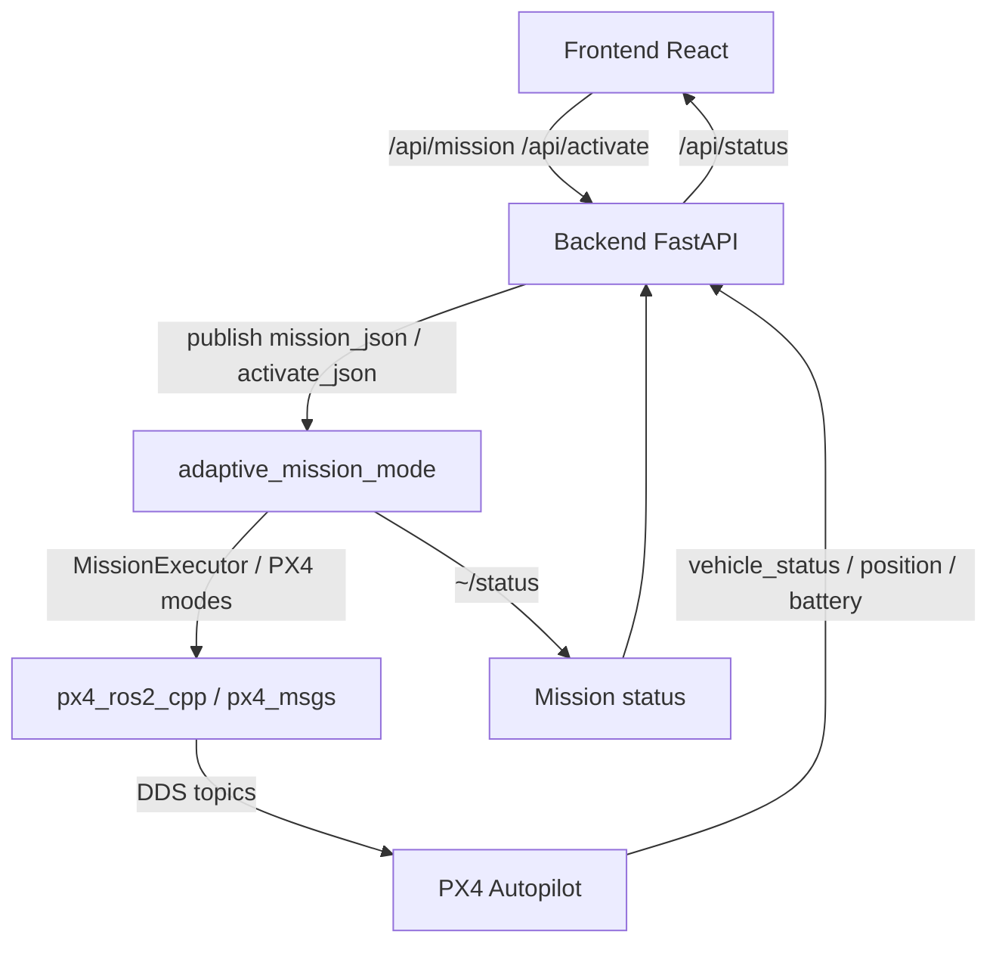
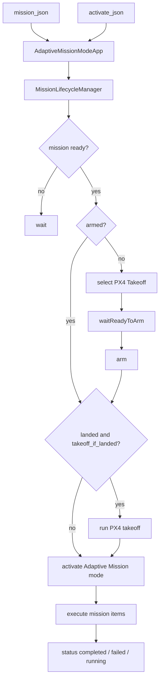

# Mission Mode Executor Architecture

ROS 2 workspace cho PX4 external mission mode, kèm web UI để tạo mission, publish mission runtime, kích hoạt mission, và theo dõi trạng thái drone.

Trung tâm hiện tại của repo là package `adaptive_mission_mode`, nhưng project không chỉ có ROS node. Repo này gồm đủ các phần:

- ROS 2 mission executor chạy trên companion computer
- vendor PX4 interface libraries để nói chuyện với PX4 qua DDS
- FastAPI backend bridge giữa web UI và ROS 2
- React frontend để dựng mission và quan sát trạng thái

## Tổng quan hệ thống



## Mục tiêu hiện tại

- nạp mission runtime bằng JSON qua topic ROS 2
- kích mission qua `activate_json`, node sẽ tự `arm`, nếu đang ở mặt đất thì tự `takeoff`, rồi mới chạy mission
- hỗ trợ UI để save, run, và xem status mission
- chuẩn bị kiến trúc để sau này mở rộng multi-drone theo namespace như `uav1`, `uav2`

## Cấu trúc repo

```text
.
├── src/
│   ├── adaptive_mission_mode/
│   └── external/
├── ui/
│   ├── backend/
│   └── frontend/
├── services/
├── scripts/
└── note.txt
```

### `src/adaptive_mission_mode/`

ROS 2 package chính của project.

Chức năng:

- đăng ký PX4 external mode `Adaptive Mission`
- nhận mission runtime qua `~/mission_json`
- nhận trigger start qua `~/activate_json`
- publish mission status qua `~/status`
- điều phối behavior tree và mission lifecycle

Tài liệu chi tiết:

- [Package README](src/adaptive_mission_mode/README.md)

### `src/external/`

Vendor dependencies đang dùng trong workspace:

- `px4_msgs`
- `px4_ros2_interface_lib`

Phần này cung cấp:

- PX4 DDS messages
- `px4_ros2_cpp`
- `MissionExecutor`, mode executor, action, trajectory interfaces

### `ui/backend/`

FastAPI backend bridge giữa UI và ROS 2.

Chức năng:

- publish mission tới topic ROS 2
- publish activate request tới topic ROS 2
- đọc `vehicle_status`, `battery_status`, `global_position`
- đọc mission runtime status từ `adaptive_mission_mode`
- có thêm nhánh MAVLink để giữ GCS heartbeat và gửi command trực tiếp khi cần

Tài liệu chi tiết:

- [Backend README](ui/backend/README.md)

### `ui/frontend/`

React + Vite frontend cho operator.

Chức năng:

- tạo mission JSON từ form/UI
- map/waypoint editor
- run mission
- xem mission runtime status
- xem snapshot vehicle và MAVLink state

Tài liệu chi tiết:

- [Frontend README](ui/frontend/README.md)

### `services/`

Chứa file template cho triển khai dưới dạng service.

### `note.txt`

Ghi chú chạy nhanh khi test local bằng terminal.

## Flow runtime hiện tại



## Multi-drone

Thiết kế hiện tại đi theo hướng:

- 1 node `adaptive_mission_mode` cho 1 drone
- mỗi drone chạy trong namespace riêng
- ví dụ `uav1`, `uav2`

Ví dụ:

```bash
ros2 launch adaptive_mission_mode adaptive_mission_mode.launch.py drone_namespace:=uav1
```

Khi đó topic runtime sẽ thành:

- `/uav1/adaptive_mission_mode/mission_json`
- `/uav1/adaptive_mission_mode/activate_json`
- `/uav1/adaptive_mission_mode/status`

## Quick start

### 1. Build workspace

```bash
cd ~/mission-mode-executor-arch
source /opt/ros/humble/setup.bash
colcon build --symlink-install --packages-select adaptive_mission_mode
source install/setup.bash
```

### 2. Start PX4 DDS bridge

```bash
MicroXRCEAgent udp4 -p 8888
```

### 3. Run ROS mission node

```bash
ros2 launch adaptive_mission_mode adaptive_mission_mode.launch.py
```

### 4. Run backend

```bash
cd ui/backend
python3 -m venv .venv
source .venv/bin/activate
pip install -r requirements.txt

source /opt/ros/humble/setup.bash
source ~/mission-mode-executor-arch/install/setup.bash
uvicorn app.main:app --reload --host 0.0.0.0 --port 8000
```

### 5. Run frontend

```bash
cd ui/frontend
npm install
npm run dev
```

## Manual ROS test

Nạp mission runtime:

```bash
ros2 topic pub --once /adaptive_mission_mode/mission_json std_msgs/msg/String \
  "{data: '{\"version\":1,\"mission\":{\"defaults\":{\"horizontalVelocity\":5.0,\"verticalVelocity\":2.0,\"maxHeadingRate\":60.0},\"items\":[{\"type\":\"takeoff\",\"altitude_m\":10.0},{\"type\":\"navigation\",\"navigationType\":\"waypoint\",\"x\":47.3977419,\"y\":8.5455939,\"z\":500.0,\"frame\":\"global\"},{\"type\":\"rtl\"}]}}'}"
```

Payload này tuân theo schema chuẩn của `px4_ros2::Mission` trong PX4 ROS2 lib: `version`, `mission.defaults`, `mission.items[]`.

Kích hoạt mission:

```bash
ros2 topic pub --once /adaptive_mission_mode/activate_json std_msgs/msg/String \
  '{data: "{\"activate\":true}"}'
```

Xem status:

```bash
ros2 topic echo /adaptive_mission_mode/status
```

## Test

Build kèm unit test:

```bash
cd ~/mission-mode-executor-arch
source /opt/ros/humble/setup.bash
colcon build --packages-select adaptive_mission_mode --cmake-args -DBUILD_TESTING=ON
source install/setup.bash
```

Chạy gtest của package:

```bash
ctest --test-dir build/adaptive_mission_mode -R adaptive_mission_mode_unit_tests --output-on-failure
```

Chạy riêng test end-to-end auto arm + takeoff + mission complete:

```bash
./build/adaptive_mission_mode/adaptive_mission_mode_unit_tests \
  --gtest_filter=MissionLifecycleManagerTest.AutoArmTakeoffAndCompletesRtlMissionFromGround
```

## Tài liệu nên đọc tiếp

- [adaptive_mission_mode package README](src/adaptive_mission_mode/README.md)
- [UI backend README](ui/backend/README.md)
- [UI frontend README](ui/frontend/README.md)
