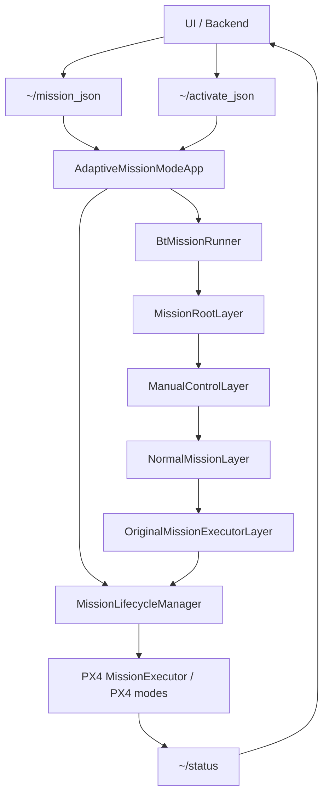
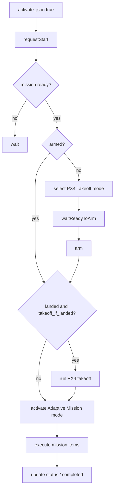
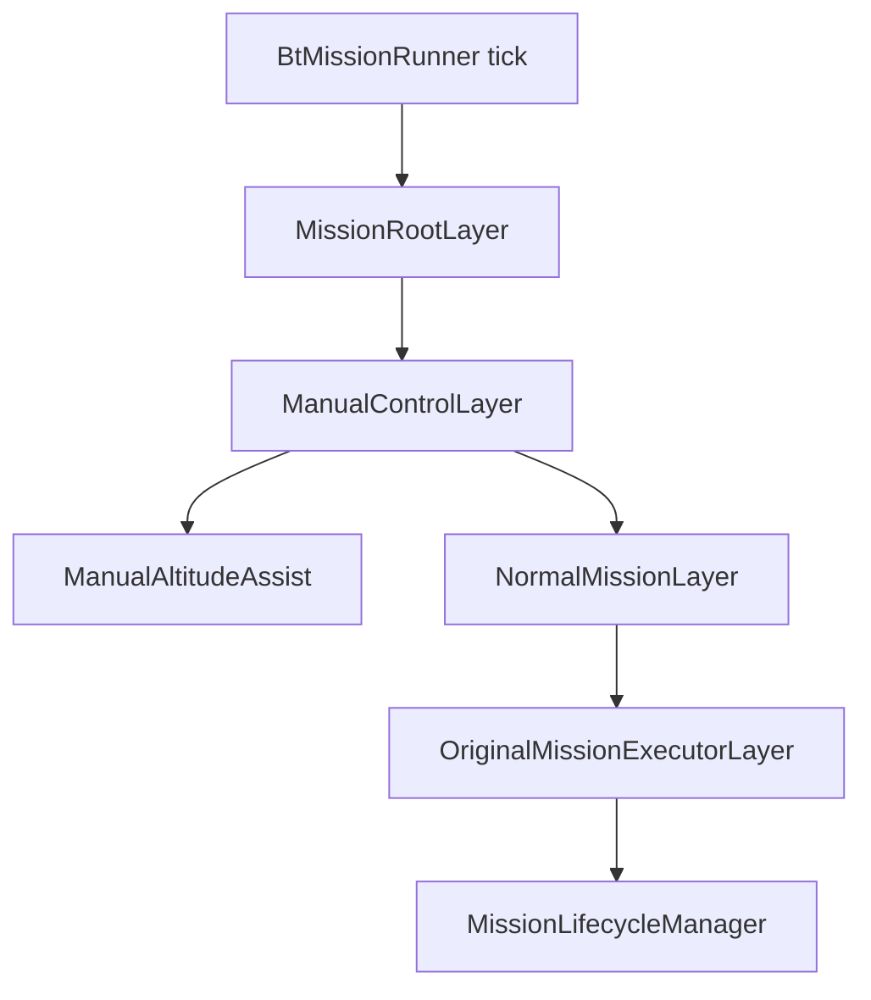

# adaptive_mission_mode

ROS 2 node đăng ký PX4 external mode `Adaptive Mission` và chạy mission qua `px4_ros2::MissionExecutor`.

Trạng thái hiện tại của package:

- có thể nạp mission runtime qua `~/mission_json`
- có thể kích chạy qua `~/activate_json`, node sẽ tự `arm`, tự `takeoff` khi đang landed, rồi mới chạy mission body
- vẫn giữ nhánh built-in mission trong `normal_mission_layer`
- có lớp `manual_control_layer` để pilot đẩy throttle lên mà mission vẫn tiếp tục
- phần waypoint đã được tách riêng để sau này gắn thêm servo, gimbal, hoặc action khi tới waypoint

## Sơ đồ flow

### 1. Luồng tổng từ input tới output



### 2. Flow start mission



### 3. Cây behavior tree hiện tại



Ý nghĩa:

```text
AdaptiveMissionModeApp
  Ghép toàn bộ module, đăng ký callback PX4, tạo topic runtime.

MissionRootLayer
  Tầng gốc của cây hành vi hiện tại.

ManualControlLayer
  Cập nhật manual altitude assist mỗi tick.
  Roll/pitch/yaw hiện không can thiệp mission.
  Throttle dương làm tăng altitude offset của toàn mission.

NormalMissionLayer
  Chứa nhánh chạy mission chính.
  Hiện tại chỉ bọc `OriginalMissionExecutorLayer`.

OriginalMissionExecutorLayer
  Tick `MissionLifecycleManager`, phần này quyết định khi nào auto-arm, khi nào chạy PX4 takeoff trước mission, và khi nào activate mission body.
```

## Cấu trúc thư mục

```text
src/
├── main.cpp
├── adaptive_mission_mode.cpp
├── core/
│   ├── mission_blackboard.cpp
│   ├── mission_status_publisher.cpp
│   ├── mission_types.cpp
│   └── vehicle_interface.cpp
└── behavior_tree/
    ├── core/
    │   └── bt_mission_runner.cpp
    └── mission_root/
        ├── mission_root_layer.cpp
        ├── manual_control_layer/
        │   ├── manual_altitude_assist.cpp
        │   └── manual_control_layer.cpp
        └── normal_mission_layer/
            ├── builtin_mission_provider.cpp
            ├── mission_lifecycle_manager.cpp
            ├── normal_mission_layer.cpp
            ├── original_mission_executor_layer.cpp
            └── mission_items/
                ├── action_items/
                │   ├── hold_action_item_builder.cpp
                │   └── rtl_action_item_builder.cpp
                └── waypoint_items/
                    └── waypoint_mission_item_builder.cpp
```

Header layout tương ứng nằm trong:

```text
include/adaptive_mission_mode/
```

## Giải thích các thành phần chính

### `src/adaptive_mission_mode.cpp`

Điểm ghép chính của app:

- đăng ký `AdaptiveMissionExecutor`
- tạo `VehicleInterface`
- tạo `MissionLifecycleManager`
- tạo `BuiltinMissionProvider`
- subscribe:
  - `~/mission_json`
  - `~/activate_json`
- nạp built-in mission nếu `mission.builtin_type != none`

### `src/core/vehicle_interface.cpp`

Bridge giữa node và PX4:

- đọc `vehicle_status`
- đọc `vehicle_local_position`
- đọc `manual_control_setpoint`
- publish `vehicle_command`

### `src/core/mission_status_publisher.cpp`

Publish JSON status của mission runtime lên:

```text
/adaptive_mission_mode/status
```

Các field chính đang publish:

- `runtime_state`
- `active_bt_branch`
- `mission_ready`
- `mission_active`
- `mission_start_in_progress`
- `current_item_index`
- `manual_altitude_active`
- `altitude_offset_m`
- `throttle_input`
- `last_error`

### `src/behavior_tree/core/bt_mission_runner.cpp`

Tạo timer tick cây hành vi theo:

```yaml
behavior_tree.tick_rate_hz
```

### `src/behavior_tree/mission_root/manual_control_layer/manual_altitude_assist.cpp`

Xử lý input throttle của pilot:

- nếu throttle tăng: tăng `altitude_offset_m`
- mission vẫn tiếp tục chạy
- chưa có logic can thiệp XY

### `src/behavior_tree/mission_root/normal_mission_layer/mission_lifecycle_manager.cpp`

Điều phối vòng đời mission:

- nhận request start
- kiểm tra ready state
- chờ PX4 status gần đây
- nếu vehicle đang disarmed thì chờ `ready-to-arm`, rồi auto arm
- nếu mission bắt đầu bằng `takeoff` hoặc `takeoff_if_landed = true` và vehicle đang landed thì chạy `PX4 Takeoff` trước mission
- activate mode executor để mission body bắt đầu chạy

### `src/behavior_tree/mission_root/normal_mission_layer/builtin_mission_provider.cpp`

Tạo built-in mission bằng C++ khi cần.

Mission type hiện có:

- `none`
- `takeoff_rtl`
- `takeoff_hold_rtl`
- `takeoff_waypoint_rtl`

## `mission_items` dùng để làm gì

`normal_mission_layer/mission_items/` là chỗ tách nhỏ từng loại mission item để dễ mở rộng.

### `action_items/`

Chứa builder cho các action hiện tại:

- `hold_action_item_builder`
- `rtl_action_item_builder`

Ý nghĩa:

- mỗi action có file riêng
- mỗi action có parameter riêng
- hiện tại `MissionExecutor` dùng trực tiếp default action của `px4_ros2`
- runtime `mission_json` vẫn có thể khai báo `takeoff` ở đầu mission theo schema chuẩn `px4_ros2::Mission`
- bên trong app, leading `takeoff` đó được map sang pha mission-start để flow `auto arm -> PX4 takeoff -> mission body` ổn định hơn

Lưu ý hiện tại:

- `hold` đã dùng được `duration`
- `rtl` hiện chỉ tạo action `rtl`

### `waypoint_items/`

Hiện tại có:

- `waypoint_mission_item_builder`

Nó đang tạo 1 waypoint mission item tổng quát từ config:

- `mission.waypoint.id`
- `mission.waypoint.latitude_deg`
- `mission.waypoint.longitude_deg`
- `mission.waypoint.altitude_m`

Đây là chỗ đúng để phát triển thêm về sau, ví dụ:

- `on_reached_actions/servo_trigger`
- `on_reached_actions/gimbal_command`
- `inspection_waypoint`
- `payload_waypoint`

## Runtime interface hiện tại

### Input topic

Nạp mission:

```bash
ros2 topic pub --once /adaptive_mission_mode/mission_json std_msgs/msg/String \
  "{data: '{\"version\":1,\"mission\":{\"defaults\":{\"horizontalVelocity\":5.0,\"verticalVelocity\":2.0,\"maxHeadingRate\":60.0},\"items\":[{\"type\":\"takeoff\",\"altitude_m\":10.0},{\"type\":\"navigation\",\"navigationType\":\"waypoint\",\"x\":47.3977419,\"y\":8.5455939,\"z\":500.0,\"frame\":\"global\"},{\"type\":\"rtl\"}]}}'}"
```

Payload trên đi đúng schema chuẩn của `px4_ros2::Mission`: `version`, `mission.defaults`, `mission.items[]`.
App parse trực tiếp bằng parser của thư viện, nên các item chuẩn như `takeoff`, `navigation/waypoint`, `hold`, `rtl`
đều đi theo format của PX4 ROS2 lib.

`takeoff` được hỗ trợ ở đầu mission JSON theo kiểu PX4 mission quen thuộc. App sẽ map leading `takeoff`
thành pha takeoff lúc bắt đầu mission, rồi mới chạy các item còn lại như `waypoint`, `hold`, `rtl`.

Nếu muốn set độ cao takeoff:

- `altitude_m`: độ cao relative tính từ lúc bắt đầu takeoff, ví dụ `10.0`
- `altitude` / `altitudeAmsl` / `z`: độ cao AMSL tuyệt đối nếu anh muốn truyền thẳng kiểu PX4 command

Kích chạy:

```bash
ros2 topic pub --once /adaptive_mission_mode/activate_json std_msgs/msg/String \
  '{data: "{\"activate\":true}"}'
```

### Output topic

Xem status:

```bash
ros2 topic echo /adaptive_mission_mode/status
```

### Multi-drone theo namespace

Ví dụ chạy node cho `uav1`:

```bash
ros2 launch adaptive_mission_mode adaptive_mission_mode.launch.py drone_namespace:=uav1
```

Khi đó:

- runtime topic sẽ thành `/uav1/adaptive_mission_mode/mission_json`
- runtime topic activate sẽ thành `/uav1/adaptive_mission_mode/activate_json`
- status topic sẽ thành `/uav1/adaptive_mission_mode/status`
- PX4 FMU topic sẽ được map vào `/uav1/fmu/...`

## Built-in mission config hiện tại

```yaml
mission:
  builtin_type: "none"   # none | takeoff_rtl | takeoff_hold_rtl | takeoff_waypoint_rtl
  auto_start: false
  start_policy:
    takeoff_if_landed: true
    takeoff_completion_timeout_sec: 45.0
  horizontal_velocity_m_s: 5.0
  vertical_velocity_m_s: 2.0
  max_heading_rate_rad_s: 1.0

  action_items:
    hold:
      id: "hold"
      duration_s: 5.0
    rtl:
      id: "rtl"

  waypoint:
    id: "waypoint"
    latitude_deg: 47.3977419
    longitude_deg: 8.5455939
    altitude_m: 10.0
```

## Hướng mở rộng hợp lý tiếp theo

Nếu anh muốn waypoint trở thành nhánh mạnh hơn trong tương lai, bước tiếp theo nên là:

```text
mission_items/
  waypoint_items/
    waypoint_mission_item_builder.*
    waypoint_hooks/
      servo_hook.*
      gimbal_hook.*
      camera_hook.*
```

Khi đó `WaypointMissionItemBuilder` chỉ còn nhiệm vụ tạo waypoint core, còn các hành vi “khi tới waypoint thì làm gì” sẽ nằm ở `waypoint_hooks`.

## Build

```bash
cd ~/mission-mode-executor-arch
source /opt/ros/humble/setup.bash
colcon build --symlink-install --packages-select adaptive_mission_mode
```

## Unit test mới

Build kèm test:

```bash
cd ~/mission-mode-executor-arch
source /opt/ros/humble/setup.bash
colcon build --packages-select adaptive_mission_mode --cmake-args -DBUILD_TESTING=ON
source install/setup.bash
```

Chạy toàn bộ unit test của package:

```bash
ctest --test-dir build/adaptive_mission_mode -R adaptive_mission_mode_unit_tests --output-on-failure
```

Chạy riêng test end-to-end auto arm + takeoff + mission complete:

```bash
./build/adaptive_mission_mode/adaptive_mission_mode_unit_tests \
  --gtest_filter=MissionLifecycleManagerTest.AutoArmTakeoffAndCompletesRtlMissionFromGround
```

Các case chính đang được cover:

- `ModeExecutorArmIsRejectedUntilMissionModeIsSelected`
- `AutoStartSelectsTakeoffModeBeforeArming`
- `AutoArmTakeoffAndCompletesRtlMissionFromGround`

Nếu anh chạy `colcon test --packages-select adaptive_mission_mode` thì ngoài gtest còn chạy cả lint của package.
